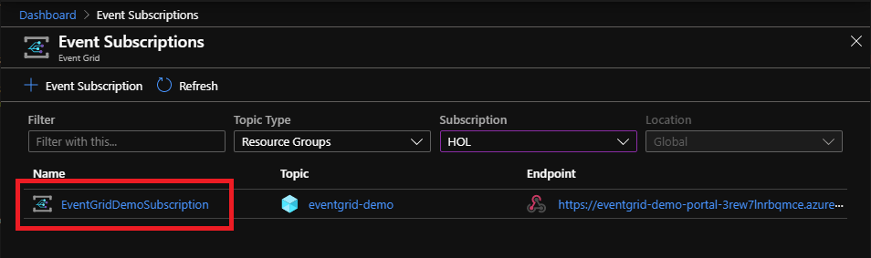

# Event Grid Publisher and Subscriber Demo

## Contents

1. Create an Event Grid Viewer App with Azure Resource Manager (ARM) template
1. Create a subscription with Azure CLI
1. Make changes to Resource Group by adding a new resource and deleting it
1. Confirm the event is pushed to Event Grid Viewer app

## Mechanics

- Event Grid Viewer is a web app (Home Page) that exposes WebHooks endpoint
- Create an Event Grid Subscription with Azure Resource Manager to publish events to Event Grid Viewer's WebHooks endpoint
- Make changes to Resource Group so Azure Resource Manager publishes events
- Event Grid Viewer displays the contents of received events (Topic)


## Event Grid Viewer

Using Event Grid Viewer app from <https://github.com/Azure-Samples/azure-event-grid-viewer>, set up a web site by clicking "Deploy to Azure" button below :

<a href="https://portal.azure.com/#create/Microsoft.Template/uri/https%3A%2F%2Fraw.githubusercontent.com%2Fdaisukeiot%2FAzure-IoT-Messaging%2Fmaster%2FEventGrid%2FEventGridARM.json" target="_blank"></a>

### Deploy Event Grid Viewer Web App

The ARM template will deploy `App Service` and `App Service Plan` with following parameters

- Subscription  
    Select your Azure subscription
- Resource Group  
    Create a new resource group or use existing one
- Location  
    Select nearest Azure data center location
- Site Name : Becomes your website's sub-domain  
    Provide a globally unique name or accept default ([Resource Group Name]-Web-[Hash])
    e.g. <http://[Site-Name].azurewebsites.net>  
- Hosting Plan Name  
    Provide a name for App Service or accept default ([Resource Group name]-Plan)
- SKU : F1 is fine, if F1 is already used, D1 ($9.49/month)


Once deployed, you can access the web site with <http://[Site_Name].azurewebsites.net>

Optionally, you can find the URL in App Service's Overview page at Azure Portal


Open Event Grid Viewer site and confirm you can access


## Event Grid Subscription

Setting a new subscription means :

- Register an endpoint so Event Grid can call the endpoint when events are published
- Register events, or `Event Type`, that we are interested in  
  We will use Azure Resource Manager as a publisher.  Azure Resource Manager publishes events when there are changes to resources, such as creating and deleting a resource.

There are multiple ways you can configure the subscription

- [Azure Portal](https://docs.microsoft.com/en-us/azure/event-grid/subscribe-through-portal)  
- [Powershell](https://docs.microsoft.com/en-us/azure/event-grid/scripts/event-grid-powershell-azure-subscription)
- [Az CLI](https://docs.microsoft.com/en-us/azure/event-grid/scripts/event-grid-cli-azure-subscription)

### Azure Resource Manager as a Event Publisher

Resource Group generates events from Azure Resource Manager on various events such as when a new resource is created or deleted.

Full list of Event Types from Azure Resource Manager :

<https://docs.microsoft.com/en-us/azure/event-grid/event-schema-resource-groups#available-event-types>

### Install Azure CLI Event Grid extension

We will use Azure CLI to create an Event Grid subscription.

Install Event Grid extension with :

```bash
az extension add --name eventgrid
```

### Create an Event Grid Subscription

In order to create a new Event Grid Subscription, we need to provide :

- A new of the Event Grid Subscription  
- ID of source resource that publishes events  
  E.g. the ID of Resource Group we want to subscribe events
- Endpoint to push events  
  E.g. WebHooks endpoint of Event Grid Viewer

- Windows

    ```cmd

    # Select the Azure subscription that contains the resource group that we want to receive events
    az account set --subscription "<name or ID of the subscription>"

    # Get resource ID of the resource group that we want to receive events
    resourceGroupID=$(az group show --name <Resource Group Name> --query id --output tsv)

    # Create a new Event Grid Subscription
    az eventgrid event-subscription create \
      --name <Name of the new Event Grid Subscription> \
      --source-resource-id %resourceGroupID% \
      --endpoint "<endpoint URL>"
    ```

- Linux

    ```bash
    az account set --subscription "<name or ID of the subscription>"

    resourceGroupID=$(az group show --name <Resource Group Name> --query id --output tsv)

    az eventgrid event-subscription create \
      --name <Name of the new Event Grid Subscription> \
      --source-resource-id $resourceGroupID \
      --endpoint "<endpoint URL>"
    ```

#### Example

- Name : EventGridDemoSubscription
- Source Resource ID : /subscriptions/46e2593f-996e-4982-a929-8d07ea946e79/resourceGroups/EventGrid-Demo  
- Endpoint : <https://eventgrid-demo-portal-3rew7lnrbqmce.azurewebsites.net/api/updates>

This will create an event subscription called `EventGridDemoSubscription`


You can also confirm the subscription in "Event Grid Subscriptions" view



- Windows

    ```cmd
    set SubscriptionName=EventGridDemoSubscription
    set ResourceGroupName=EventGrid-Demo
    set Endpoint="https://eventgrid-demo-portal-3rew7lnrbqmce.azurewebsites.net/api/updates"

    for /f "tokens=*" %i in ('az group show --name %ResourceGroupName% --query id') do set resourceGroupID=%i
    az eventgrid event-subscription create --name EventGridDemoSubscription --source-resource-id %resourceGroupID% --endpoint %Endpoint%

    {
      "deadLetterDestination": null,
      "destination": {
        "endpointBaseUrl": "https://eventgrid-demo-portal-3rew7lnrbqmce.azurewebsites.net/api/updates",
        "endpointType": "WebHook",
        "endpointUrl": null
      },
      "expirationTimeUtc": null,
        :
        :
      "labels": null,
      "name": "EventGridDemoSubscription",
      "provisioningState": "Succeeded",
      "resourceGroup": "EventGrid-Demo",
      "retryPolicy": {
        "eventTimeToLiveInMinutes": 1440,
        "maxDeliveryAttempts": 30
      },
      "topic": "/subscriptions/46e2593f-996e-4982-a929-8d07ea946e79/resourceGroups/eventgrid-demo",
      "type": "Microsoft.EventGrid/eventSubscriptions"
    }
    ```

- Linux

    ```bash
    SubscriptionName=EventGridDemoSubscription
    ResourceGroupName=EventGrid-Demo
    Endpoint=https://eventgrid-demo-portal-3rew7lnrbqmce.azurewebsites.net/api/updates
    resourceGroupID=$(az group show --name EventGrid-Demo --query id --output tsv)  
    az eventgrid event-subscription create --name $SubscriptionName --source-resource-id $resourceGroupID --endpoint $Endpoint
    {
      "deadLetterDestination": null,
      "deadLetterWithResourceIdentity": null,
      "deliveryWithResourceIdentity": null,
      "destination": {
        "azureActiveDirectoryApplicationIdOrUri": null,
        "azureActiveDirectoryTenantId": null,
        "endpointBaseUrl": "https://eventgrid-demo-portal-3rew7lnrbqmce.azurewebsites.net/api/updates",
        "endpointType": "WebHook",
        "endpointUrl": null,
       :
       :
      "retryPolicy": {
        "eventTimeToLiveInMinutes": 1440,
        "maxDeliveryAttempts": 30
      },
      "topic": "/subscriptions/46e2593f-996e-4982-a929-8d07ea946e79/resourceGroups/eventgrid-demo",
      "type": "Microsoft.EventGrid/eventSubscriptions"
    }
    ```

> [!TIP]  
> If you receive this error, register Microsoft.EventGrid in your subscription  
>
> ```text
> Deployment failed. Correlation ID: e123fa65-1bd0-4fb4-9fcb-7273d011738a.
> The Microsoft.EventGrid resource provider is not registered in subscription aabbccdd-eeee-ffff-gggg-hhiijjkkllmm.
> To resolve this, register the provider in the subscription and retry the operation.
> ```
>
> Register Microsoft.EventGrid to your subscription with :
>
> ```bash
> az provider register --namespace Microsoft.EventGrid
> ```
>
> Or in [Azure Portal](https://docs.microsoft.com/en-us/azure/azure-resource-manager/templates/error-register-resource-provider#solution-3---azure-portal), navigate to `Resource Providers` page from your subscription

## Create a resource

Let's create a resource in the resource group so you can see events in Event Grid Viewer

Create Device Provisioning Service (DPS) with :

- Windows

    ```cmd
    az iot dps create --resource-group %ResourceGroupName% --name EventGridViewerDPS
    ```

- Linux

    ```bash
    az iot dps create --resource-group $ResourceGroupName --name EventGridViewerDPS
    ```

Example :

```bash
az iot dps create --resource-group $ResourceGroupName --name EventGridViewerDPS
{
  "etag": "AAAAAAKXN58=",
  "id": "/subscriptions/46e2593f-996e-4982-a929-8d07ea946e79/resourceGroups/EventGrid-Demo/providers/Microsoft.Devices/provisioningServices/EventGridViewerDPS",
  "location": "westus2",
  "name": "EventGridViewerDPS",
  "properties": {
    "allocationPolicy": "Hashed",
    "authorizationPolicies": null,
    "deviceProvisioningHostName": "global.azure-devices-provisioning.net",
    "idScope": "0ne000DF9ED",
    "iotHubs": [],
    "provisioningState": "Succeeded",
    "serviceOperationsHostName": "EventGridViewerDPS.azure-devices-provisioning.net",
    "state": "Active"
  },
  "resourcegroup": "EventGrid-Demo",
  "sku": {
    "capacity": 1,
    "name": "S1",
    "tier": "Standard"
  },
  "subscriptionid": "46e2593f-996e-4982-a929-8d07ea946e79",
  "tags": {},
  "type": "Microsoft.Devices/provisioningServices"
}
```

## Confirm Events are pushed to Event Grid Viewer

You should see new events in Event Grid Viewer.

> [!TIP]  
> You may have to wait for event delivery for few seconds to a minute or so


## Other Azure services as publishers

|Service                |Link     |
|-----------------------|---------|
|App Configuration      | <https://docs.microsoft.com/en-us/azure/event-grid/event-schema-app-configuration> |
|Azure Machine Learning | <https://docs.microsoft.com/en-us/azure/event-grid/event-schema-machine-learning>|
|Azure Maps             | <https://docs.microsoft.com/en-us/azure/event-grid/event-schema-azure-maps> |
|Azure SingalR          | <https://docs.microsoft.com/en-us/azure/event-grid/event-schema-azure-signalr>|
|Blob Storage           | <https://docs.microsoft.com/en-us/azure/event-grid/event-schema-blob-storage>         |
|Container Registry     | <https://docs.microsoft.com/en-us/azure/event-grid/event-schema-container-registry>         |
|Event Hubs             | <https://docs.microsoft.com/en-us/azure/event-grid/event-schema-event-hubs>         |
|IoT Hub                | <https://docs.microsoft.com/en-us/azure/event-grid/event-schema-iot-hub> |
|Key Vault              | <https://docs.microsoft.com/en-us/azure/event-grid/event-schema-key-vault>|
|Media Services         | <https://docs.microsoft.com/en-us/azure/media-services/latest/media-services-event-schemas?toc=/azure/event-grid/toc.json>|
|Resource Group         | <https://docs.microsoft.com/en-us/azure/event-grid/event-schema-resource-groups>        |
|Service Bus            | <https://docs.microsoft.com/en-us/azure/event-grid/event-schema-service-bus> |
|Subscription           | <https://docs.microsoft.com/en-us/azure/event-grid/event-schema-subscriptions>         |

## Clean Up

Clean up the resource group you created from this demo with :

> [!CAUTION]  
> This will also delete Event Viewer Grid Viewer

- Windows

    ```cmd
    az group delete --name %ResourceGroupName% --yes
    ```

- Linux

    ```bash
    az group delete --name $ResourceGroupName --yes
    ```
