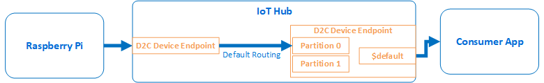
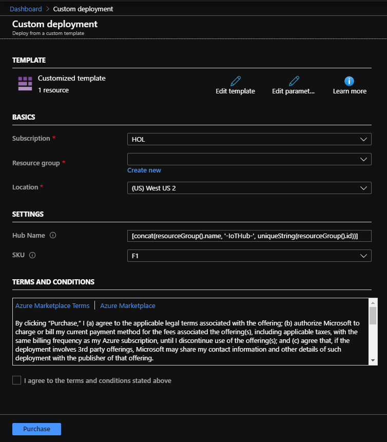
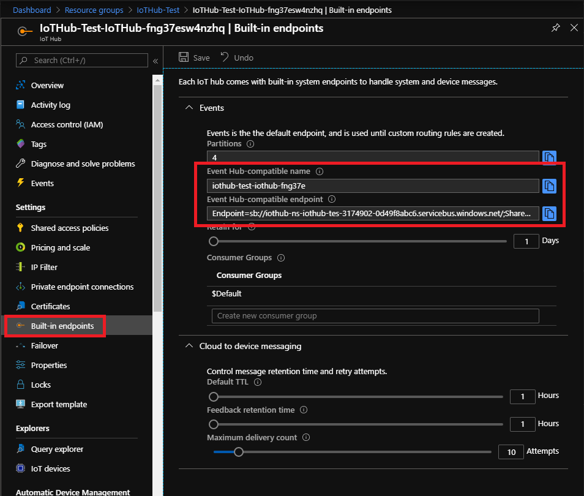
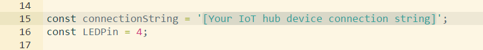
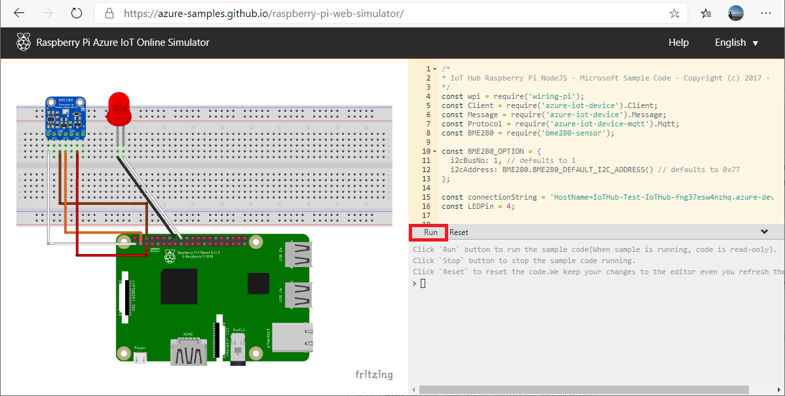

# IoT Hub Device Messages with the Built-in Endpoint

## Contents

1. Create an IoT Hub with Azure Resource Manager (ARM) template
1. Run Event Hubs Consumer (Subscriber) App
1. Run IoT Device  
    - Using Raspberry Pi Simulator
    - Using Raspberry Pi

## Mechanics

- Event Hubs Consumer App listen for events through `$default` consumer group
- Raspberry Pi sends device messages (Telemetry)
- IoT Hub receives device messages
- Device messages are routed to Messages/Events Endpoint
  - Message are routed using default message routing to Event Hubs Compatible Service Endpoint
  - IoT Hub uses Device Id as a partition key so all events from a single device are sent to a single partition
- Events are pushed to the Event Hubs Consumer App



## Install Azure CLI IoT extension

We will use Azure CLI to create an Event Grid subscription.

Install IoT extension with :

```bash
az extension add --name azure-iot
```

## IoT Hub Resource

In this demo, we will send device messages to IoT Hub, then consume the events with Event Hubs consumer application

Deploy IoT Hub by clicking "Deploy to Azure" button below :

<a href="https://portal.azure.com/#create/Microsoft.Template/uri/https%3A%2F%2Fraw.githubusercontent.com%2Fdaisukeiot%2FAzure-IoT-Messaging%2Fmaster%2FIoTHub%2FIoTHubARM.json" target="_blank"></a>

### Deploy IoT Hub

- Subscription  
    Select your Azure subscription
- Resource Group  
    Create a new resource group or use existing one
- Location  
    Select nearest Azure data center location
- Hub Name
    Name of IoT Hub.  Must be globally unique.  Use default name or provide your own.  
  - Default Value : [Resource Group Name]-IoTHub-[Hash]

- SKU  
    SKU of IoT Hub.  Either F1 (Free) or S1.



### IoT Hub Setting

The ARM Template will create Event Hubs with following settings

| Name     | Setting | Description             |
|----------|---------|-------------------------|
| Hub Name | From UI | Must be globally unique |
| SKU      | From UI | F1 (Free) or S1.        |

## IoT Device

Send Device Messages using Raspberry Pi Simulator @ <https://azure-samples.github.io/raspberry-pi-web-simulator/>

The simulator sends temperature and humidity data

Example :

```json
{
  "messageId": 9,
  "deviceId": "Raspberry Pi Web Client",
  "temperature": 25.293387665047458,
  "humidity": 61.611402195148116
}
```

### Create Device Identity in IoT Hub

Open a new CMD window then create 2 IoT Devices with :

- Windows

    ```cmd
    az iot hub device-identity create --device-id rp-simulator-01 --hub-name %iothubname%
    ```

- Linux

    ```bash
    az iot hub device-identity create --device-id rp-simulator-01 --hub-name $iothubname
    ```

This will create an IoT Devices with Device Id `rp-simulator-01`

## Consumer App

To run the Consumer App you need :

1. Connection String
1. Consumer Group : `$Default`
1. Event Hub Name

### Retrieve Event Hub Name

#### Azure Portal

Information on the Event Hubs compatible endpoint is available at Azure Portal.

1. Select IoT Hub in Azure Portal
1. Select `Built-in endpoints`



Run the Consumer App with `Connection String` and `Event Hub-compatible` name

```cmd
cd C:\Azure-IoT-Messaging\EventHubs\Consumer
dotnet run -cs <Connection String> -cg "$Default" -hub <Event Hub-compatible name>
```

#### Az CLI

Open a new CMD window then run the consumer app with :

- Windows

    ```cmd
    set iothubname=<Name of IoT Hub>

    cd ~/Azure-IoT-Messaging/EventHubs/Consumer
    for /f "tokens=*" %i in ('az iot hub show --query properties.eventHubEndpoints.events.path --name $iothubname') do set eventhub=%i
    for /f "tokens=*" %i in ('az iot hub show --query properties.eventHubEndpoints.events.endpoint --name $iothubname') do set endpoint=%i
    for /f "tokens=*" %i in ('az iot hub policy show --hub-name $iothubname --name iothubowner --query primaryKey') do set key=%i
    set cs="Endpoint=$endpoint;SharedAccessKeyName=iothubowner;SharedAccessKey=$key"
    dotnet run -cs %cs% -cg "$Default" -hub %eventhub%
    ```

- Linux

    ```bash
    iothubname=<Name of IoT Hub>

    cd ~/Azure-IoT-Messaging/EventHubs/Consumer
    eventhub="$(az iot hub show --query properties.eventHubEndpoints.events.path --name $iothubname --output tsv)"
    endpoint="$(az iot hub show --query properties.eventHubEndpoints.events.endpoint --name $iothubname --output tsv)"
    key="$(az iot hub policy show --hub-name $iothubname --name iothubowner --query primaryKey --output tsv)"
    cs="Endpoint=$endpoint;SharedAccessKeyName=iothubowner;SharedAccessKey=$key"
    dotnet run -cs $cs -cg "$Default" -hub $eventhub
    ```

> [!TIP]
> Optionally, you can read all events in the Event Hub with `-all` option

### Consumer App Example

```text
dotnet run -cs $cs -hub $eventhub -cg "$Default"
Connection String : Endpoint=sb://iothub-ns-iothub-tes-3174902-0d49f8a....
Event Hub         : iothub-test-iothub-fng37e
Consumer Group    : $Default
Read all events   : False
Timeout           : 600 seconds
Read Start        : 04/01/2020 01:32:38
Waiting for events.  CTRL+C to exit
```

## Run Raspberry Pi Online Simulator

Browse to <https://azure-samples.github.io/raspberry-pi-web-simulator/>

Reference : [Connect Raspberry Pi online simulator to Azure IoT Hub (Node.js)](https://docs.microsoft.com/en-us/azure/iot-hub/iot-hub-raspberry-pi-web-simulator-get-started)

### Retrieve Device Connection Strings

Retrieve device connection strings for 2 device identities created above with :

- Windows

    ```cmd
    az iot hub device-identity show-connection-string --device-id rp-simulator-01 --hub-name %iothubname% --output tsv
    ```

- Linux

    ```bash
    az iot hub device-identity show-connection-string --device-id rp-simulator-01 --hub-name $iothubname --output tsv
    ```

### Replace Connection String

In coding area, replace the placeholder for in line #15 with the device connection string from above.



```nodejs
/*
* IoT Hub Raspberry Pi NodeJS - Microsoft Sample Code - Copyright (c) 2017 - Licensed MIT
*/
const wpi = require('wiring-pi');
const Client = require('azure-iot-device').Client;
const Message = require('azure-iot-device').Message;
const Protocol = require('azure-iot-device-mqtt').Mqtt;
const BME280 = require('bme280-sensor');

const BME280_OPTION = {
  i2cBusNo: 1, // defaults to 1
  i2cAddress: BME280.BME280_DEFAULT_I2C_ADDRESS() // defaults to 0x77
};

const connectionString = '[Your IoT hub device connection string]';  <<=================

```

### Run the simulator

Click `Run` button to start sending telemetry to IoT Hub.



## Add More Devices

Repeat steps [above](#create-device-identity-in-iot-hub), and run multiple Raspberry Pi Online Simulators.

- Because IoT Hub uses Device Id (The Id you used to create device identities) as a partition key, events from a device are routed to the same partition
- From the consumers point of view, how you access data is identical to Event Hubs

## Cleanup

To clean up resources, run

- Windows

    ```cmd
    az group delete --name $(az iot hub show --query resourcegroup --name %iothubname% --output tsv) --yes
    ```

- Linux

    ```bash
    az group delete --name $(az iot hub show --query resourcegroup --name $iothubname --output tsv) --yes
    ```
